Economic Measures as Predictors of 2016 Opioid Overdose Deaths in California
================

-   [Introduction](#introduction)
    -   [Objective](#objective)
    -   [Background](#background)
    -   [Description of the Dataset](#description-of-the-dataset)
-   [Statistical Analysis](#statistical-analysis)
    -   [Possible Regression Models](#possible-regression-models)
    -   [Correlations](#correlations)
    -   [Collinearity](#collinearity)
    -   [Linear Regression](#linear-regression)
    -   [Poisson/Negative Binomial Regression](#poissonnegative-binomial-regression)
    -   [Logistic Regression](#logistic-regression)
    -   [Beta Regression](#beta-regression)
    -   [Model Comparison](#model-comparison)
-   [Conclusion](#conclusion)

### Introduction

#### Objective

In this analysis I will try to evaluate if the following socio-economic measures are associated with county opioid death rates in California for 2016: median income, median home price, poverty rate, unemployment rate, and high school graduation rate.

I will use regression models to look for any significant link between economic measures and death rates; I will not be investigating causality. The goal is not to build a predictive model but rather to understand associations between death rates and economic measures.

#### Background

U.S. overdose deaths involving opioids have been rising since 2000. The opioid epidemic claimed over 42,000 lives nationwide in 2016. The average U.S. death rate for that year was 13 per 100,000 residents, an almost 30% increase from 2015, with states like West Virginia suffering death rates in the 40’s. Although the average 2016 rate for California, at 5, was lower than the U.S. average, select counties have seen soaring death rates in recent years.

Source: <https://www.kff.org/other/state-indicator/opioid-overdose-death-rates/?currentTimeframe=1&sortModel=%7B%22colId%22:%22Location%22,%22sort%22:%22asc%22%7D> (Kaiser Family Foundation analysis of Centers for Disease Control and Prevention (CDC), National Center for Health Statistics)

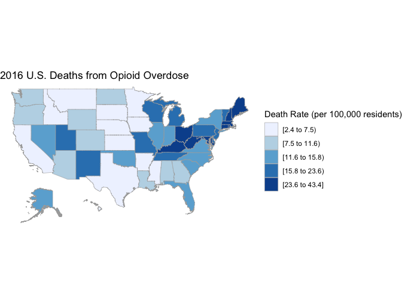

In 2015, the Princeton economists Anne Case and Angus Deaton showed a skyrocketing death rate among middle aged white Americans without high school degrees, mostly fueled by ‘deaths of despair’, or deaths from alcohol, drugs and suicide. Their paper implied that the increase in deaths can be linked to a deterioration in economic well-being among this population. In 2016, the University of Virginia economist Christopher Ruhm argued that deteriorating economic conditions account for very little (less than 10%) of the rise in opioid deaths and that drug supply (readily available opioids) are to blame for the increase in deaths. He did find some correlation between economic deterioration and death rates, but according to him, economic decline was not a causal factor for the rising rates. Ruhm used median income, median home price, poverty rate, unemployment rate as well as import exposure in his analysis.

As stated in the objective, here I will try using similar socio-economic measures to see if they are associated with county opioid death rates in California for 2016: median income, median home price, poverty rate, unemployment rate, and high school graduation rate.

Sources:       Joel Achenbach and Dan Keating. "New research identifies a ‘sea of despair’ among white, working-class Americans." Washington Post, March 23, 2017. <https://www.washingtonpost.com/national/health-science/new-research-identifies-a-sea-of-despair-among-white-working-class-americans/2017/03/22/c777ab6e-0da6-11e7-9b0d-d27c98455440_story.html>

Christopher J. Ruhm. "Deaths of Despair or Drug Problems?" National Bureau of Economic Research, Working Paper No. 24188 from January 2018, <https://www.nber.org/papers/w24188>

#### Description of the Dataset

The data consists of 2016 county-level data for California. Death rates for opioid overdoses (reported in deaths per 100,000 residents) are from the California Department of Health via the Los Angeles Daily News. Median income and median home price (measured in dollars), and poverty rates (percent of households under a threshold income) are reported from the U.S. Census Bureau. Percent of adults over 25 years of age without a high school degree also comes from the U.S. Census Bureau. Unemployment rates (percent of people in the labor force unemployed) are from the Bureau of Labor Statistics.

The first few lines of the dataset:

<table class="table table-condensed">
<thead>
<tr>
<th style="text-align:right;">
County
</th>
<th style="text-align:right;">
Death.Rate
</th>
<th style="text-align:right;">
Unemployment
</th>
<th style="text-align:right;">
Poverty
</th>
<th style="text-align:right;">
Median.Income
</th>
<th style="text-align:right;">
Home.Price
</th>
<th style="text-align:right;">
no.high.school
</th>
</tr>
</thead>
<tbody>
<tr>
<td style="text-align:right;">
Alameda
</td>
<td style="text-align:right;">
2.63
</td>
<td style="text-align:right;">
4.3
</td>
<td style="text-align:right;">
10.7
</td>
<td style="text-align:right;">
79831
</td>
<td style="text-align:right;">
593500
</td>
<td style="text-align:right;">
13.6
</td>
</tr>
<tr>
<td style="text-align:right;">
Alpine
</td>
<td style="text-align:right;">
0.00
</td>
<td style="text-align:right;">
6.5
</td>
<td style="text-align:right;">
18.6
</td>
<td style="text-align:right;">
62375
</td>
<td style="text-align:right;">
329500
</td>
<td style="text-align:right;">
9.6
</td>
</tr>
<tr>
<td style="text-align:right;">
Amador
</td>
<td style="text-align:right;">
15.61
</td>
<td style="text-align:right;">
6.0
</td>
<td style="text-align:right;">
11.3
</td>
<td style="text-align:right;">
57032
</td>
<td style="text-align:right;">
265900
</td>
<td style="text-align:right;">
11.9
</td>
</tr>
<tr>
<td style="text-align:right;">
Butte
</td>
<td style="text-align:right;">
7.07
</td>
<td style="text-align:right;">
6.6
</td>
<td style="text-align:right;">
19.5
</td>
<td style="text-align:right;">
44366
</td>
<td style="text-align:right;">
228500
</td>
<td style="text-align:right;">
12.3
</td>
</tr>
<tr>
<td style="text-align:right;">
Calaveras
</td>
<td style="text-align:right;">
9.97
</td>
<td style="text-align:right;">
5.7
</td>
<td style="text-align:right;">
13.1
</td>
<td style="text-align:right;">
53502
</td>
<td style="text-align:right;">
259000
</td>
<td style="text-align:right;">
7.2
</td>
</tr>
</tbody>
</table>
Below are the overdose deaths for California by county, with a closer look at Bay Area counties:       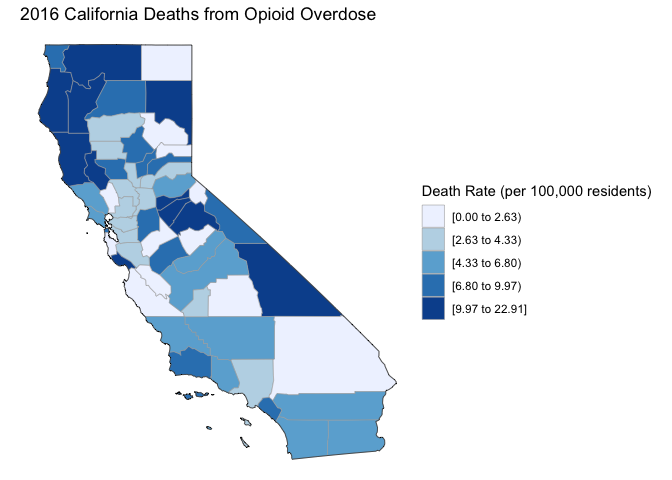

    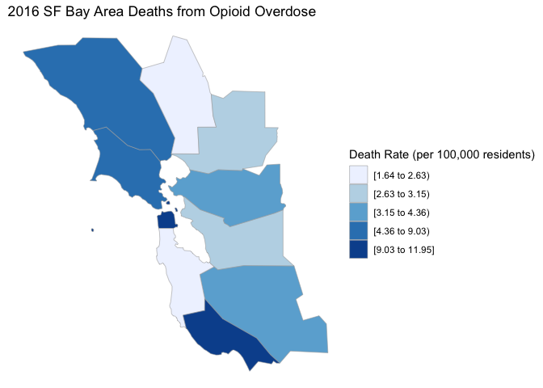

Below is the distribution of opioid overdose death rates in California from the 2016 data. The majority of deaths are less than 10/100,000 residents.

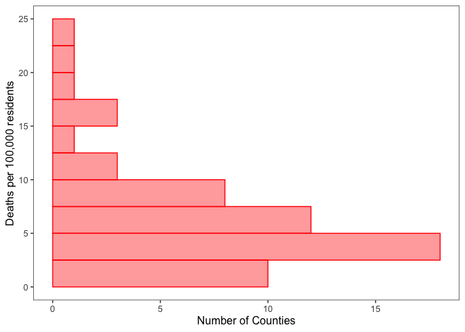

Counties with the top five highest death rates:

<table class="table table-condensed">
<thead>
<tr>
<th style="text-align:right;">
County
</th>
<th style="text-align:right;">
Death.Rate
</th>
</tr>
</thead>
<tbody>
<tr>
<td style="text-align:right;">
Inyo
</td>
<td style="text-align:right;">
22.91
</td>
</tr>
<tr>
<td style="text-align:right;">
Humboldt
</td>
<td style="text-align:right;">
22.35
</td>
</tr>
<tr>
<td style="text-align:right;">
Lassen
</td>
<td style="text-align:right;">
17.79
</td>
</tr>
<tr>
<td style="text-align:right;">
Mendocino
</td>
<td style="text-align:right;">
17.34
</td>
</tr>
<tr>
<td style="text-align:right;">
Siskiyou
</td>
<td style="text-align:right;">
16.05
</td>
</tr>
<tr>
<td style="text-align:right;">
Amador
</td>
<td style="text-align:right;">
15.61
</td>
</tr>
</tbody>
</table>
Below is the distribution of median income and median home price for California, as well as tables showing counties with highest and lowest income.       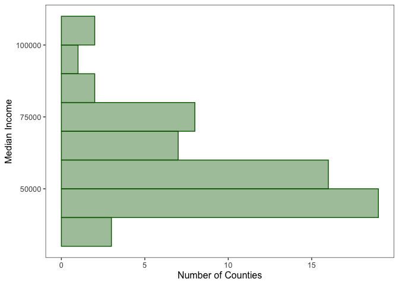 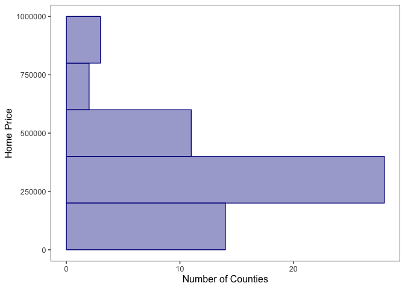

    Counties with top median incomes:

<table class="table table-condensed">
<thead>
<tr>
<th style="text-align:right;">
County
</th>
<th style="text-align:right;">
Median.Income
</th>
</tr>
</thead>
<tbody>
<tr>
<td style="text-align:right;">
Santa Clara
</td>
<td style="text-align:right;">
101173
</td>
</tr>
<tr>
<td style="text-align:right;">
Marin
</td>
<td style="text-align:right;">
100310
</td>
</tr>
<tr>
<td style="text-align:right;">
San Mateo
</td>
<td style="text-align:right;">
98546
</td>
</tr>
<tr>
<td style="text-align:right;">
San Francisco
</td>
<td style="text-align:right;">
87701
</td>
</tr>
<tr>
<td style="text-align:right;">
Contra Costa
</td>
<td style="text-align:right;">
82881
</td>
</tr>
<tr>
<td style="text-align:right;">
Alameda
</td>
<td style="text-align:right;">
79831
</td>
</tr>
</tbody>
</table>
    Counties with lowest median incomes:

<table class="table table-condensed">
<thead>
<tr>
<th style="text-align:right;">
County
</th>
<th style="text-align:right;">
Median.Income
</th>
</tr>
</thead>
<tbody>
<tr>
<td style="text-align:right;">
Modoc
</td>
<td style="text-align:right;">
41194
</td>
</tr>
<tr>
<td style="text-align:right;">
Tehama
</td>
<td style="text-align:right;">
40687
</td>
</tr>
<tr>
<td style="text-align:right;">
Siskiyou
</td>
<td style="text-align:right;">
38524
</td>
</tr>
<tr>
<td style="text-align:right;">
Lake
</td>
<td style="text-align:right;">
36132
</td>
</tr>
<tr>
<td style="text-align:right;">
Trinity
</td>
<td style="text-align:right;">
35270
</td>
</tr>
</tbody>
</table>
### Statistical Analysis

#### Possible Regression Models

There are several regression models I could try for modeling this data.

The dependent variable (Death Rate) represents the number of deaths per 100,000 residents. Unfortunately, each number of cases in the dataset has been rounded to two decimal places, so it is not a discrete number. The reported cases can be turned into a proportion by dividing the number by 100,000.

<table class="table table-condensed">
<thead>
<tr>
<th style="text-align:right;">
County
</th>
<th style="text-align:right;">
Death.Rate
</th>
<th style="text-align:right;">
proportion
</th>
</tr>
</thead>
<tbody>
<tr>
<td style="text-align:right;">
Santa Clara
</td>
<td style="text-align:right;">
3.15
</td>
<td style="text-align:right;">
3.15e-05
</td>
</tr>
<tr>
<td style="text-align:right;">
Marin
</td>
<td style="text-align:right;">
5.87
</td>
<td style="text-align:right;">
5.87e-05
</td>
</tr>
<tr>
<td style="text-align:right;">
San Mateo
</td>
<td style="text-align:right;">
2.37
</td>
<td style="text-align:right;">
2.37e-05
</td>
</tr>
<tr>
<td style="text-align:right;">
San Francisco
</td>
<td style="text-align:right;">
9.03
</td>
<td style="text-align:right;">
9.03e-05
</td>
</tr>
<tr>
<td style="text-align:right;">
Contra Costa
</td>
<td style="text-align:right;">
4.19
</td>
<td style="text-align:right;">
4.19e-05
</td>
</tr>
<tr>
<td style="text-align:right;">
Alameda
</td>
<td style="text-align:right;">
2.63
</td>
<td style="text-align:right;">
2.63e-05
</td>
</tr>
</tbody>
</table>
First, because the dependent variable can be seen as a continuous number, I will try to see if it is possible to fit a linear regression model to the data.

Discrete counts can be modeled with Poisson or negative binomial regression models. Because I don't have discrete counts, I can try rounding the dependent variable and applying these regression techniques. Obviously, distorting the dependent variable in this way is not an ideal approach, but it may be interesting to see how it compares to the other models.

Finally, proportions can also be modelled using logistic regression or beta regression. Because there are 0's present in the dataset, the dependent variable will also have to be transformed to apply beta regression, since the variable must be a value falling between 0 and 1 (and not including 0 or 1).

#### Correlations

Correlations between variables can be seen in the matrix below. There is a high correlation between home price and median income at 0.9, as well as poverty rate and median income at -.8 (maximum correlation is at -1 and 1). This shows a strong linear relationship between these variables. 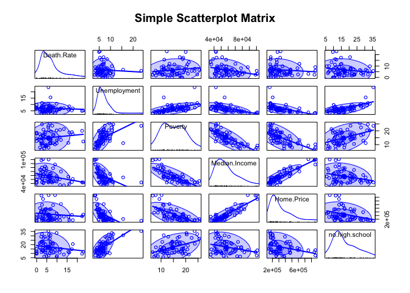

    ##                 Death.Rate Unemployment    Poverty Median.Income
    ## Death.Rate      1.00000000  -0.06984975  0.1607762    -0.3014827
    ## Unemployment   -0.06984975   1.00000000  0.5333181    -0.5006992
    ## Poverty         0.16077621   0.53331808  1.0000000    -0.7895246
    ## Median.Income  -0.30148267  -0.50069923 -0.7895246     1.0000000
    ## Home.Price     -0.10862716  -0.54703218 -0.6726119     0.8995521
    ## no.high.school -0.18361546   0.68214623  0.4662468    -0.2985242
    ##                Home.Price no.high.school
    ## Death.Rate     -0.1086272     -0.1836155
    ## Unemployment   -0.5470322      0.6821462
    ## Poverty        -0.6726119      0.4662468
    ## Median.Income   0.8995521     -0.2985242
    ## Home.Price      1.0000000     -0.3369497
    ## no.high.school -0.3369497      1.0000000

    ## Call:corr.test(x = opioids[, 2:7], y = NULL, use = "pairwise", method = "pearson", 
    ##     adjust = "holm", alpha = 0.05)
    ## Correlation matrix 
    ##                Death.Rate Unemployment Poverty Median.Income Home.Price
    ## Death.Rate           1.00        -0.07    0.16         -0.30      -0.11
    ## Unemployment        -0.07         1.00    0.53         -0.50      -0.55
    ## Poverty              0.16         0.53    1.00         -0.79      -0.67
    ## Median.Income       -0.30        -0.50   -0.79          1.00       0.90
    ## Home.Price          -0.11        -0.55   -0.67          0.90       1.00
    ## no.high.school      -0.18         0.68    0.47         -0.30      -0.34
    ##                no.high.school
    ## Death.Rate              -0.18
    ## Unemployment             0.68
    ## Poverty                  0.47
    ## Median.Income           -0.30
    ## Home.Price              -0.34
    ## no.high.school           1.00
    ## Sample Size 
    ## [1] 58
    ## Probability values (Entries above the diagonal are adjusted for multiple tests.) 
    ##                Death.Rate Unemployment Poverty Median.Income Home.Price
    ## Death.Rate           0.00         0.83    0.68          0.13       0.83
    ## Unemployment         0.60         0.00    0.00          0.00       0.00
    ## Poverty              0.23         0.00    0.00          0.00       0.00
    ## Median.Income        0.02         0.00    0.00          0.00       0.00
    ## Home.Price           0.42         0.00    0.00          0.00       0.00
    ## no.high.school       0.17         0.00    0.00          0.02       0.01
    ##                no.high.school
    ## Death.Rate               0.67
    ## Unemployment             0.00
    ## Poverty                  0.00
    ## Median.Income            0.13
    ## Home.Price               0.07
    ## no.high.school           0.00
    ## 
    ##  To see confidence intervals of the correlations, print with the short=FALSE option

#### Collinearity

Conventionally, a VIF between 5 and 10 indicates high correlation; if the VIF is higher than 10, interpretation of the regression coefficients is problematic because of multicollinearity. Below we can see that there may be issues with median income and home price.

    ##   Unemployment        Poverty  Median.Income     Home.Price no.high.school 
    ##       2.385407       3.321108       8.378769       5.926796       2.084394

#### Linear Regression

I initially tried to model the data by applying a linear regression. This was only possible with a transformation of the dependent variable, as assumptions for linear regression were not met with the data as is. Also, some of the outliers had to be removed in order to meet the assumptions. Removing outliers from this dataset is very problematic, as the dataset is small and outliers reflect true observations rather than errors. Also, the transformation on the dependent variable makes it more difficult to interpret the outcome.

After an initial attempt, the best fitting model was an additive model with just median income and home price as the explanatory variables, the two highly correlated variables. However, as mentioned above, the assumptions for using linear regression were not met (non-constant variance is present):

    ## 
    ## Call:
    ## lm(formula = Death.Rate ~ Median.Income + Home.Price, data = opioids)
    ## 
    ## Residuals:
    ##    Min     1Q Median     3Q    Max 
    ## -7.747 -2.722 -0.384  2.359 12.881 
    ## 
    ## Coefficients:
    ##                 Estimate Std. Error t value Pr(>|t|)    
    ## (Intercept)    1.853e+01  3.052e+00   6.072 1.23e-07 ***
    ## Median.Income -3.485e-04  8.842e-05  -3.941 0.000231 ***
    ## Home.Price     2.468e-05  7.848e-06   3.144 0.002684 ** 
    ## ---
    ## Signif. codes:  0 '***' 0.001 '**' 0.01 '*' 0.05 '.' 0.1 ' ' 1
    ## 
    ## Residual standard error: 4.723 on 55 degrees of freedom
    ## Multiple R-squared:  0.2294, Adjusted R-squared:  0.2014 
    ## F-statistic: 8.187 on 2 and 55 DF,  p-value: 0.0007721

    ## Analysis of Variance Table
    ## 
    ## Model 1: Death.Rate ~ Median.Income + Home.Price
    ## Model 2: Death.Rate ~ Unemployment + Poverty + Median.Income + Home.Price + 
    ##     no.high.school
    ##   Res.Df    RSS Df Sum of Sq      F Pr(>F)
    ## 1     55 1226.7                           
    ## 2     52 1129.4  3    97.213 1.4919 0.2276

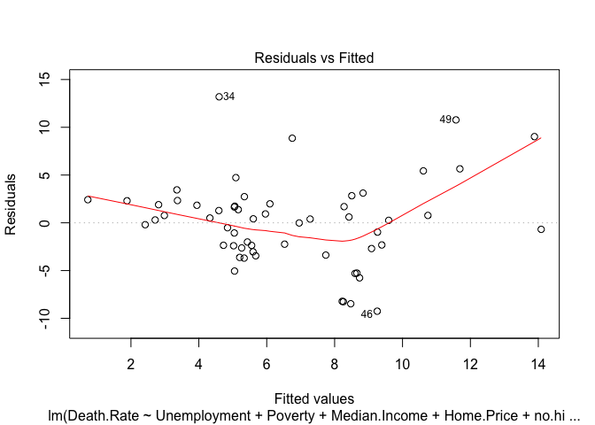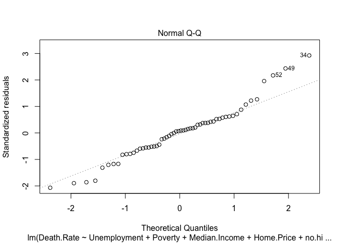

    ## 
    ##  Shapiro-Wilk normality test
    ## 
    ## data:  lm_fit1$residuals
    ## W = 0.96275, p-value = 0.07227

    ## Non-constant Variance Score Test 
    ## Variance formula: ~ fitted.values 
    ## Chisquare = 7.606921, Df = 1, p = 0.0058145

I tried using a Box Cox transformation to see if this would normalize the data. The results suggests taking the square root of the death rate.     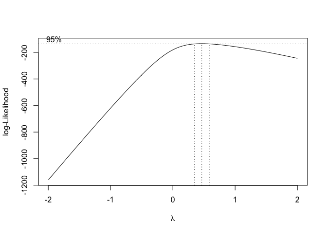

Unfortunately, while this resulted in residuals with constant variance, the residuals were still not normally distributed. 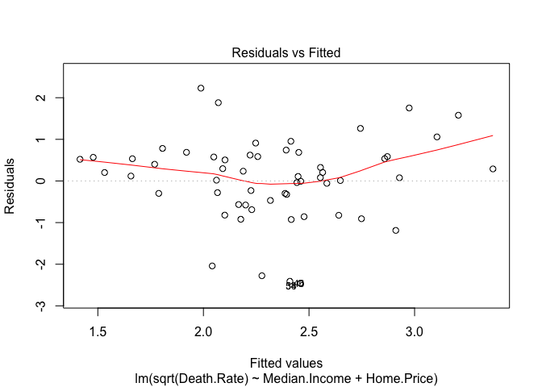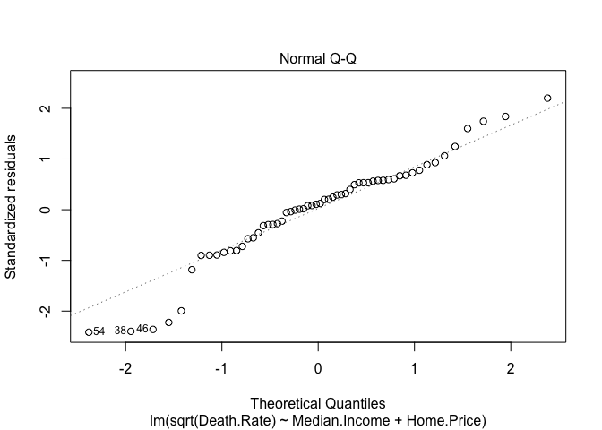

    ## 
    ##  Shapiro-Wilk normality test
    ## 
    ## data:  rline_transform$residuals
    ## W = 0.94761, p-value = 0.01415

    ## Non-constant Variance Score Test 
    ## Variance formula: ~ fitted.values 
    ## Chisquare = 0.6981284, Df = 1, p = 0.40341

Next I tried to remove some outliers. This is potentially problematic because the dataset is small and assumably does not contain any errors. I used the diagnostic plot to get an idea of some problematic ouliers. Removing observations with a death rate of zero (and low income and home price) resulted in a dataset that passed the assumptions for linear regression.

    ## No Studentized residuals with Bonferroni p < 0.05
    ## Largest |rstudent|:
    ##     rstudent unadjusted p-value Bonferroni p
    ## 54 -2.532769           0.014255       0.8268

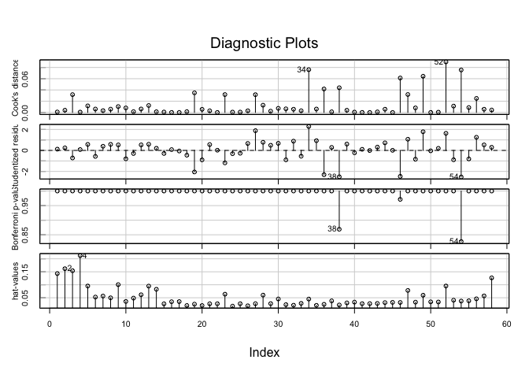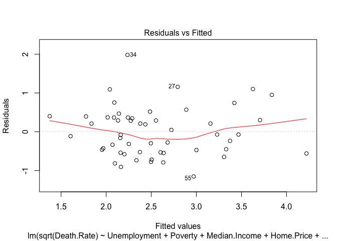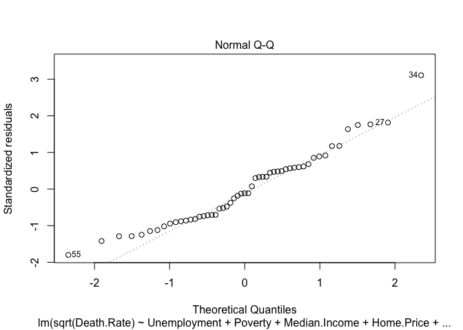

    ## 
    ##  Shapiro-Wilk normality test
    ## 
    ## data:  rline_transform2$residuals
    ## W = 0.96043, p-value = 0.07673

    ## Non-constant Variance Score Test 
    ## Variance formula: ~ fitted.values 
    ## Chisquare = 0.2335538, Df = 1, p = 0.6289

I also tried to fit a regression model to the data after the dependent variable had been transformed into a proportion. The results were similar.

The output for the final model is below. This model suggests that for every $10,000 increase in median income, the square root of death rate will decrease by 0.5 (per one hundred thousand). For every $100,000 increase in median home price, the square root of the death rate will increase by 0.4. Unfortunately, the dependent variable is now the square root of the death rate, making it harder to understand the relationship between the death rate and independent variables.

Having to remove observations to meet the requirements for linear regression for this dataset was very problematic. Another regression model would hopefully provide better answers.

    ## 
    ## Call:
    ## lm(formula = sqrt(Death.Rate) ~ Median.Income + Home.Price, data = opioid_outliers2)
    ## 
    ## Residuals:
    ##     Min      1Q  Median      3Q     Max 
    ## -2.4078 -0.5190  0.1183  0.5807  2.2385 
    ## 
    ## Coefficients:
    ##                 Estimate Std. Error t value Pr(>|t|)    
    ## (Intercept)    3.963e+00  7.707e-01   5.142 4.36e-06 ***
    ## Median.Income -5.248e-05  2.157e-05  -2.433   0.0185 *  
    ## Home.Price     4.107e-06  1.840e-06   2.232   0.0300 *  
    ## ---
    ## Signif. codes:  0 '***' 0.001 '**' 0.01 '*' 0.05 '.' 0.1 ' ' 1
    ## 
    ## Residual standard error: 1.051 on 51 degrees of freedom
    ## Multiple R-squared:  0.104,  Adjusted R-squared:  0.06891 
    ## F-statistic: 2.961 on 2 and 51 DF,  p-value: 0.06072

RMSE for the model when applied to death rates as proportions:

    ## 4.769385

Below is a plot showing observed versus fitted death rates.     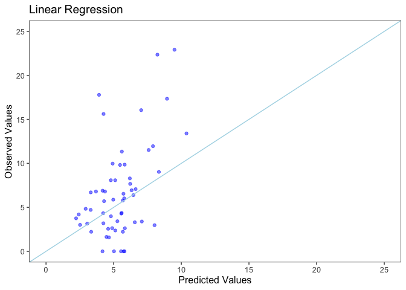

#### Poisson/Negative Binomial Regression

Next I will try a Poisson/Negative Binomial model on the data. Normally, these models are used on count data or rates when a discrete number of cases is present. Since the death rates in the data can be thought of as continouous and have a right bound, these are probably not the best models for this data. Also, since the number of cases are not discrete, I will have to round them to be able to apply the models. Since many values are close together, the rounding can have a big distortive effect.

First, I checked for overdispersion to see if a Poisson model would suffice, or if a different count data model would be preferable. To determine which of the two models (poisson or negative binomial) may be more appropriate in this case, I used a rootogram to display the attendance counts and see which distribution describes the data better. The first rootogram is for poisson, the second is for a negative binomial. The data fits the negative binomial distribution better, with the bars of the rootogram mostly touching the x-axis.

    ## 
    ##   Goodness-of-fit test for poisson distribution
    ## 
    ##                       X^2 df     P(> X^2)
    ## Likelihood Ratio 123.3608 16 1.237295e-18

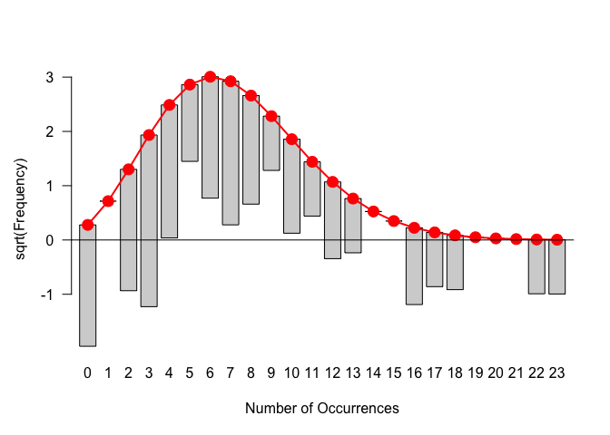

    ## 
    ##   Goodness-of-fit test for nbinomial distribution
    ## 
    ##                       X^2 df    P(> X^2)
    ## Likelihood Ratio 33.25394 15 0.004328514

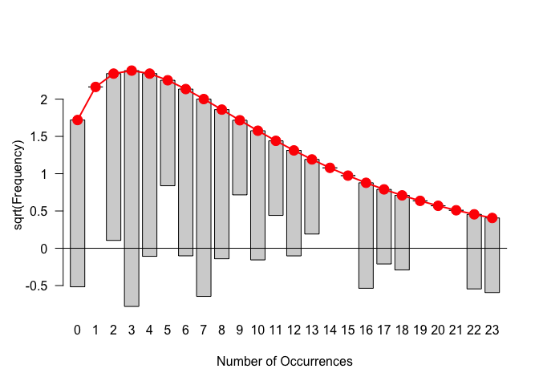

The Pearson dispersion statistic (the Pearson chi squared statistic divided by degree of freedom for residuals) is much greater than one, which indicates overdispersion. The negative binomial is more appropriate for data that is too overdispersed to fit the Poisson distribution. For the Poisson distribution, the mean is equal to the variance. However, when the conditional variance for residuals is greater than the conditional mean, the negative binomial is often a better fit because it has an extra parameter that allows it to adjust the variance independently from the mean.

    ## Pearson dispersion statistic: 2.902347

We can fit the Poisson and negative binomial models and compare fit. The negative binomial does indeed fit better.

    ## Likelihood ratio test
    ## 
    ## Model 1: rounded ~ Unemployment + Poverty + Median.Income + Home.Price + 
    ##     no.high.school
    ## Model 2: rounded ~ Unemployment + Poverty + Median.Income + Home.Price + 
    ##     no.high.school
    ##   #Df  LogLik Df  Chisq Pr(>Chisq)    
    ## 1   6 -181.32                         
    ## 2   7 -160.10  1 42.431  7.322e-11 ***
    ## ---
    ## Signif. codes:  0 '***' 0.001 '**' 0.01 '*' 0.05 '.' 0.1 ' ' 1

    ##          df      AIC
    ## fit_pois  6 374.6415
    ## fit_nb    7 334.2105

The fitted negative binomial model suggests that both median income and median home price are significantly associated with death rates. For every $10,000 increase in median income, the death rate will decrease by 40%. For every $100,000 increase in median home price, the death rate will then increase by 30%.

    ## 
    ## Call:
    ## glm.nb(formula = rounded ~ Unemployment + Poverty + Median.Income + 
    ##     Home.Price + no.high.school, data = opioids, init.theta = 3.201418917, 
    ##     link = log)
    ## 
    ## Deviance Residuals: 
    ##      Min        1Q    Median        3Q       Max  
    ## -2.90533  -0.73263   0.09466   0.44280   2.39059  
    ## 
    ## Coefficients:
    ##                  Estimate Std. Error z value Pr(>|z|)    
    ## (Intercept)     4.382e+00  1.060e+00   4.133 3.57e-05 ***
    ## Unemployment   -6.759e-03  4.482e-02  -0.151   0.8801    
    ## Poverty        -2.229e-02  3.461e-02  -0.644   0.5195    
    ## Median.Income  -4.869e-05  1.635e-05  -2.978   0.0029 ** 
    ## Home.Price      2.581e-06  1.221e-06   2.113   0.0346 *  
    ## no.high.school -1.289e-02  1.724e-02  -0.748   0.4547    
    ## ---
    ## Signif. codes:  0 '***' 0.001 '**' 0.01 '*' 0.05 '.' 0.1 ' ' 1
    ## 
    ## (Dispersion parameter for Negative Binomial(3.2014) family taken to be 1)
    ## 
    ##     Null deviance: 86.045  on 57  degrees of freedom
    ## Residual deviance: 68.316  on 52  degrees of freedom
    ## AIC: 334.21
    ## 
    ## Number of Fisher Scoring iterations: 1
    ## 
    ## 
    ##               Theta:  3.201 
    ##           Std. Err.:  0.981 
    ## 
    ##  2 x log-likelihood:  -320.210

RMSE for the negative binomial model:

    ## 4.264236

Below the plot of observed vs fittted values for the negative binomial model:

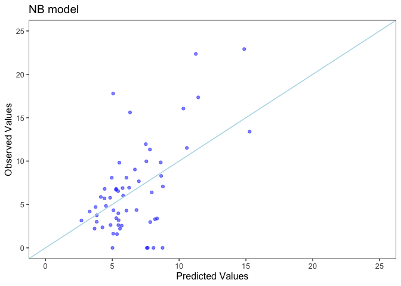

#### Logistic Regression

I will also try to model the proportions using logistic regression. The proportion is conceived of as the outcome of multiple binomial trials.(for count proportions vs continuous proportions).

Results are below. The model suggests that both median income and median home price are significantly associated with death rates. For every $10,000 increase in median income, the death rate will decrease by 43%. For every $100,000 increase in median home price, the death rate will then increase by 37%.

    ## 
    ## Call:
    ## glm(formula = proportion ~ Unemployment + Poverty + Median.Income + 
    ##     Home.Price + no.high.school, family = binomial(logit), data = opioids, 
    ##     weights = weight)
    ## 
    ## Deviance Residuals: 
    ##     Min       1Q   Median       3Q      Max  
    ## -4.1752  -1.1025   0.1718   0.7954   4.5796  
    ## 
    ## Coefficients:
    ##                  Estimate Std. Error z value Pr(>|z|)    
    ## (Intercept)    -6.808e+00  5.776e-01 -11.787  < 2e-16 ***
    ## Unemployment   -1.552e-02  2.833e-02  -0.548    0.584    
    ## Poverty        -2.487e-02  1.934e-02  -1.286    0.198    
    ## Median.Income  -5.579e-05  8.836e-06  -6.314 2.72e-10 ***
    ## Home.Price      3.144e-06  6.788e-07   4.632 3.62e-06 ***
    ## no.high.school -1.372e-02  9.802e-03  -1.399    0.162    
    ## ---
    ## Signif. codes:  0 '***' 0.001 '**' 0.01 '*' 0.05 '.' 0.1 ' ' 1
    ## 
    ## (Dispersion parameter for binomial family taken to be 1)
    ## 
    ##     Null deviance: 232.63  on 57  degrees of freedom
    ## Residual deviance: 166.70  on 52  degrees of freedom
    ## AIC: 374.74
    ## 
    ## Number of Fisher Scoring iterations: 5

RMSE for the logistic model:

    ## 4.182395

The plot of observed vs predicted values for this model: 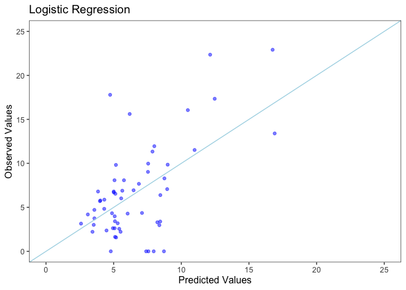

#### Beta Regression

Finally, I will fit a beta regression model on the data. The beta regression model can be used when you have rates that can't necessarily bethought of as success rates from a known number of independent trials, as in binomial data. However, beta regression cannot be used on dependent variables = 0 (range must be (0,1)). I will use the suggested transformation x'= \[x(N-1) + 0.5\]/N Alternately, the package brms can apply a zero-one inflated beta model (analogous to zero-inflated Poisson model).

The fitted beta regression model is below.

This model finds all five predictive variables to have a significant association with the death rate. For instance, the model suggests that for every $10,000 increase in median income, the death rate will decrease by 43%. For every $100,000 increase in median home price, the death rate will then increase by 37%.

    ## 
    ## Call:
    ## betareg(formula = beta ~ Unemployment + Poverty + Median.Income + 
    ##     Home.Price + no.high.school, data = opioids, weights = weight)
    ## 
    ## Standardized weighted residuals 2:
    ##       Min        1Q    Median        3Q       Max 
    ## -693.1034 -191.7895   26.6537  167.3907  973.3363 
    ## 
    ## Coefficients (mean model with logit link):
    ##                  Estimate Std. Error    z value Pr(>|z|)    
    ## (Intercept)    -4.714e+00  2.445e-05 -192838.41   <2e-16 ***
    ## Unemployment   -6.324e-05  1.009e-06     -62.68   <2e-16 ***
    ## Poverty        -2.030e-04  7.941e-07    -255.63   <2e-16 ***
    ## Median.Income  -4.545e-07  3.762e-10   -1208.25   <2e-16 ***
    ## Home.Price      2.652e-08  2.808e-11     944.14   <2e-16 ***
    ## no.high.school -1.407e-04  3.985e-07    -353.18   <2e-16 ***
    ## 
    ## Phi coefficients (precision model with identity link):
    ##       Estimate Std. Error z value Pr(>|z|)    
    ## (phi)  4596433       2699    1703   <2e-16 ***
    ## ---
    ## Signif. codes:  0 '***' 0.001 '**' 0.01 '*' 0.05 '.' 0.1 ' ' 1 
    ## 
    ## Type of estimator: ML (maximum likelihood)
    ## Log-likelihood: 5.005e+07 on 7 Df
    ## Pseudo R-squared: 0.2896
    ## Number of iterations: 11 (BFGS) + 15 (Fisher scoring)

RMSE for the beta regression:

    ## 4.410646

Plot of observed vs fitted values is below: 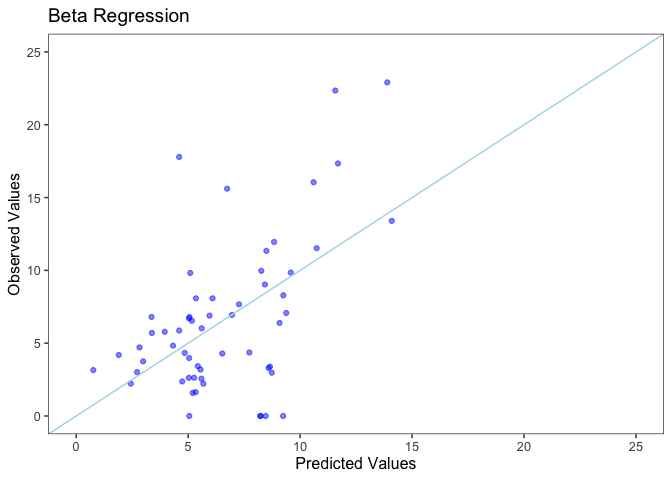

#### Model Comparison

Here I will compare results from the linear, logistic, beta and Poisson regression models.

Below is a comparison of RMSE values from the three models. Each of the models is trained to optimize different values (for instance, logistic will try to minimize log loss) and most are not trying to minimize RMSE. However, I used RMSE as the common value to compare the performance of all the models because it is a commonly used value for measuring regression model performance and capturing how a model's fitted values differ from the observed. I've converted the linear and negative binomials models to fit onto data that is on the same scale as the logistic and beta regression models to make comparison possible.

Because the data set is so small, the 95% confidence intervals for the RMSE are very wide. RMSE values for all models are quite similar. No model stands out as having a significantly better RMSE (where lower values are better).

<table class="table table-condensed">
<thead>
<tr>
<th style="text-align:right;">
Model
</th>
<th style="text-align:right;">
RMSE value
</th>
<th style="text-align:right;">
RMSE 95% CI
</th>
</tr>
</thead>
<tbody>
<tr>
<td style="text-align:right;">
NB
</td>
<td style="text-align:right;">
4.26423644820162
</td>
<td style="text-align:right;">
1.0164 , 8.0802
</td>
</tr>
<tr>
<td style="text-align:right;">
Logistic
</td>
<td style="text-align:right;">
4.18239536869327
</td>
<td style="text-align:right;">
1.0131 , 8.1643
</td>
</tr>
<tr>
<td style="text-align:right;">
Beta
</td>
<td style="text-align:right;">
4.41064559682219
</td>
<td style="text-align:right;">
1.1496 , 8.3453
</td>
</tr>
<tr>
<td style="text-align:right;">
Linear
</td>
<td style="text-align:right;">
4.76938484969111
</td>
<td style="text-align:right;">
1.0027 , 8.9413
</td>
</tr>
</tbody>
</table>
Below is a comparison of plots from each model showing observed vs predicated values, side by side. 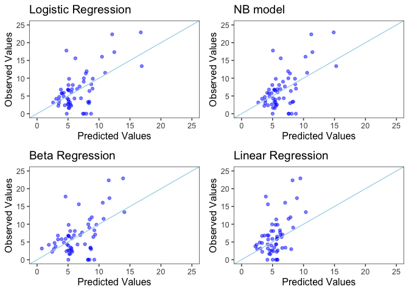

Of the four, the linear regression model seems the least desirable. Having to transform the dependent variable during linear regression makes it difficult to interpret the coefficients from the model. I had expected the removal of outliers for the linear regression to be more problematic, since the model needs to be able to predict zero death rates. However, none of the models predicted those rates adequately.

Of the four, the negative binomial model has the lowest values in its RMSE confidence interval, so that is what I would use for the final model.

### Conclusion

The negative binomial model indicates that for every $10,000 increase in median income, the death rate will decrease by 40%. For every $100,000 increase in median home price, the death rate will then increase by 30%. Using a concrete example, this means that if median income is $60,000 and the death rate is 7 per 100,000 people, a similar region with a median income of $70,000 would have a death rate of about 4 per 100,000. If median home price is $200,000 and the death rate is 7 per 100,000 people, a similar region (with similar median income) with a median home price of $300,000 would have a death rate of about 9 per 100,000.

As income goes up, death rate goes down. As home price goes up, death rate goes up. This seems counterintuitive at first, but its important to remember that median income and median home price are highly correlated. Once the effect of income is taken into account, the relationship between death rates and home price reverse. We can see this visually in the plots below.

First we can see below that, in general, death rate is lower for counties with higher incomes.

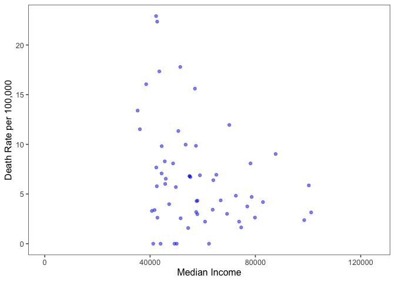

Also, in general, death rate is lower for counties with higher home prices (where a higher proportion of higher income indivudials will reside).

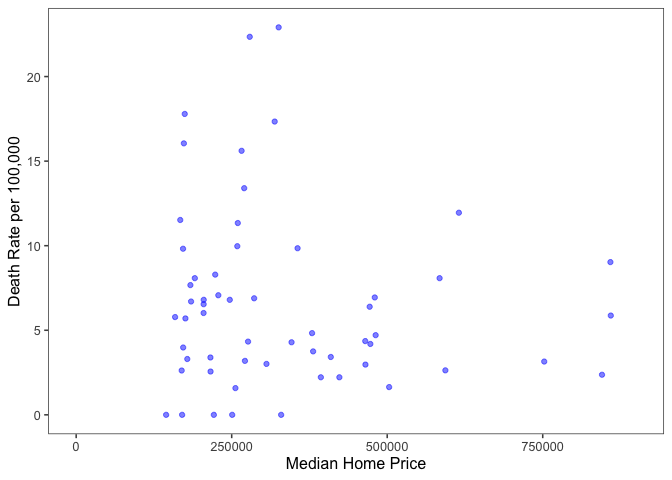

Let's take a look at death rates for places with high income and low home prices. This graph displays data for counties with a median income of 60,000 or higher. No strong signal emerges.

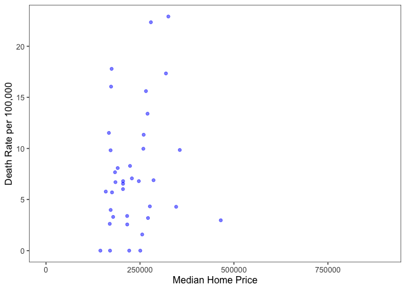

Now let's take a look at death rates for places with low income and high home prices. This graph displays data for counties with a median income less than 60,000. Here we can see that for lower income regions, higher housing prices are somewhat correlated with higher death rates.

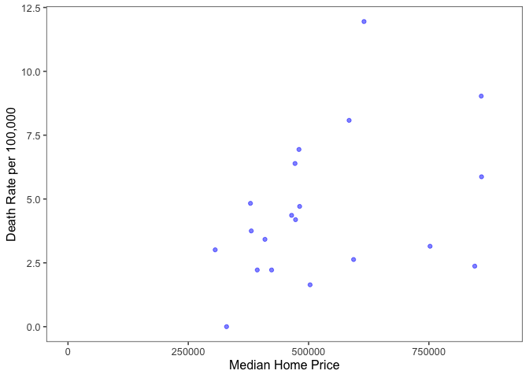

If income is low but home prices are high death rates are higher. This might be because wealthier families are buying second homes in the area, or because of a highly priced housing market and high inequality; the area will still have a relatively high proportion of lower income households despite the high home prices. The regression model is able to tease this signal out of the data.
